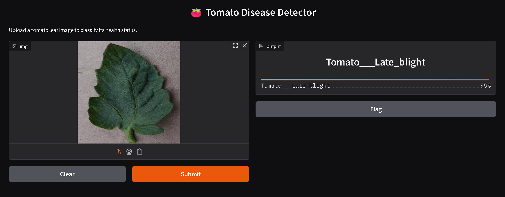

# Kisan Seva - Plant Disease Detection

A machine learning project that detects plant diseases using Transfer Learning with MobileNetV2, helping farmers identify crop issues efficiently.

---

## Features

- Detect plant diseases from leaf images
- Uses Transfer Learning (MobileNetV2)
- High accuracy classification
- Optimized for efficient performance
- Can be extended for real-world agricultural use

---

## Tech Stack

- Python
- TensorFlow / Keras
- NumPy, Pandas
- Matplotlib

---

## Screenshots

### Prediction Output


---

## How to Run

1. Install dependencies:
   ```
   pip install -r requirements.txt
   ```

2. Run the project:
   ```
   python app.py
   ```

---

## Project Purpose

This project was built to explore machine learning and transfer learning techniques for real-world agricultural applications.

---

## Author

Atharva Shivade
